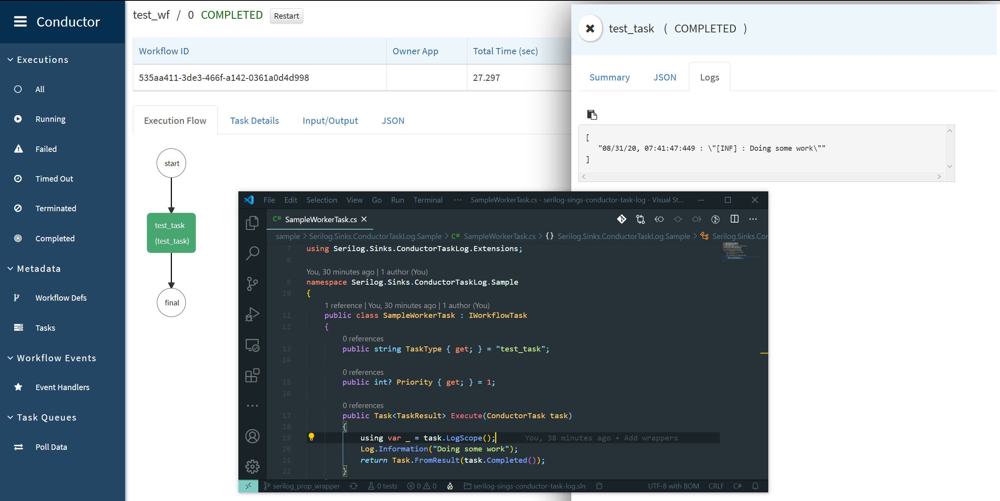

#  Serilog.Sinks.ConductorTaskLog [](https://planq.visualstudio.com/Serilog.Sinks.ConductorTaskLog/_build/latest?definitionId=1&branchName=master)  [](https://www.nuget.org/packages/Serilog.Sinks.ConductorTaskLog/)

A serilog sink that sends task logs to [Netflix Conductor](https://github.com/Netflix/conductor).
Don't use this sink as your only sink.

## Showcase



## Getting started

### Configuring

#### In code

Add the sink to your logger configuration (typically in `Program.cs`)

```csharp
Log.Logger = new LoggerConfiguration()
      ...
      .WriteTo.ConductorTaskLog("http://conductor:8080/api/") // <-- Add the sink
      .Enrich.FromLogContext() // <-- Also add this enricher
      .CreateLogger();
```

#### In appsettings.json

```json
{
   "Serilog": {
      "WriteTo": [
         {
            "Name": "ConductorTaskLog",
            "Args": {
               "conductorUrl": "http://conductor:8080/api/"
            }
         }
      ],
      "Enrich": [
         "FromLogContext"
      ]
   }
}
```

### Using

#### With [conductor-dotnet-client](https://github.com/courosh12/conductor-dotnet-client)

Add the using
```csharp
using Serilog.Sinks.ConductorTaskLog.Extensions;
```
The add this line at the start of your `Execute` method to let the sink know the taskId.
```csharp
using var _ = task.LogScope();
```

#### With something else

Add this line at the start of any method to log all events from that method
```csharp
using Serilog.Sinks.ConductorTaskLog;

using var _ = TaskLog.LogScope("taskId");
```
or like so to only log a few lines to the conductor
```csharp
Log.Information("Not logging to Netflix Conductor");
using (TaskLog.LogScope("taskId"))
{
      Log.Information("Log sent to Netflix Conductor");
}
```
